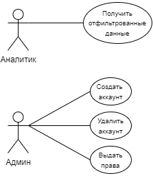
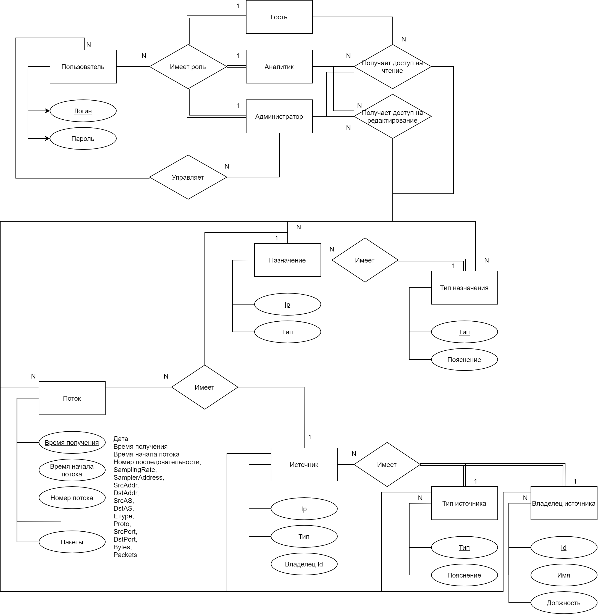

# Database course project
# Web course
BMSTU 2020-2021. 6-7th Semesters IU7

**NetFlow**, **fprobe**, **kafka**, **Clickhouse**, **docker**, **docker-compose**

# ATTENTION
В данном репозитории лежит курсовой проект по БД. РПЗ: https://github.com/DeaLoic/bmstu-CDB/blob/master/Report/report.pdf

Из источника **NetFlow** пакетов (**fprobe**, например) данные собираются через **kafka** в **Clickhouse**, откуда их можно посмотреть и изменить через NetPacketAnalyzer. **kafka**, **Clickhouse** и goflow разворачиваются в **docker** с помощью **docker-compose**

Но также на базе этого курсового были сданы курсы по Веб разработке и Проектированию ПО, что внесло существенные изменения как в код NetPacketAnalyzer, так и в деплой.

**Тонкости**:  
Деплой не содержит исходики утилиты (GOFLOW)[https://github.com/cloudflare/goflow], предназначенной для сбора NetFlow. Так же, для корректной работы в GOFLOW необходимо внести изменения:
1. Подменить flow.proto на расширенный для NetFlow
2. Расширить полями FlowMessage
3. Изменить Mocker
К сожалению измененный goflow выложить не могу, так как лицензии и в целом как-то странно...

### Launch:
cd Deploy  
docker-compose up

sudo fprobe  -iany -fip -B4096 -r2 -q10000 -t10000:10000000 0.0.0.0:2056

0.0.0.0:8234 - clickhouse  
0.0.0.0:2056 - netflow v5  
0.0.0.0:2055 - netflow v7, v9

### Цель работы
Реализовать сбор и просмотр NetFlow пакетов.

### Требования
1. Сбор NetFlow пакетов.
2. Просмотр с возможностью фильтрации NetFlow пакетов.
3. Clickhouse + kafka
4. Добавление/удаление пользователей, разделение ролей.

### Figma
---

### Use-case диаграмма системы

### ER-диаграмма сущностей системы

